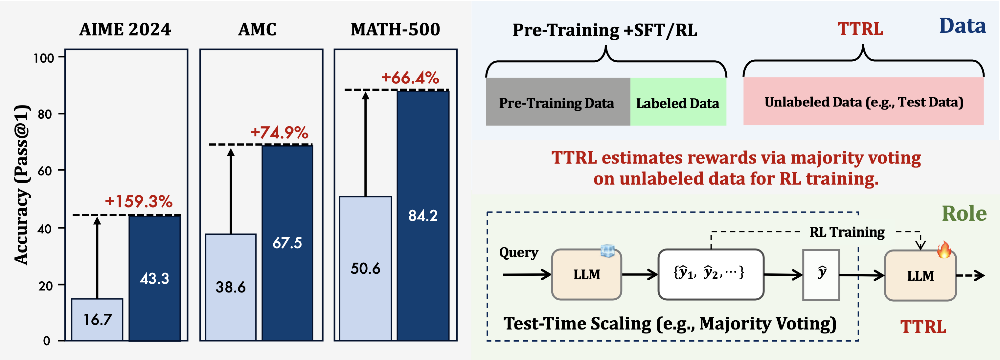
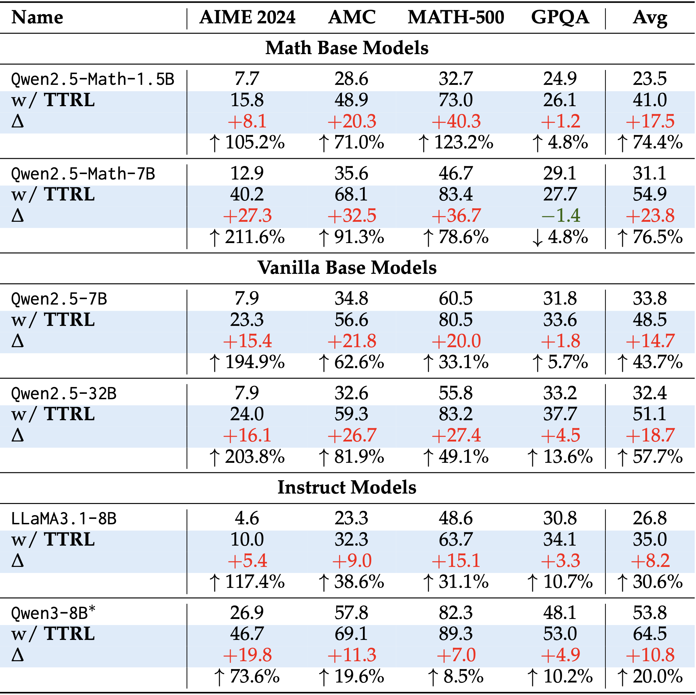
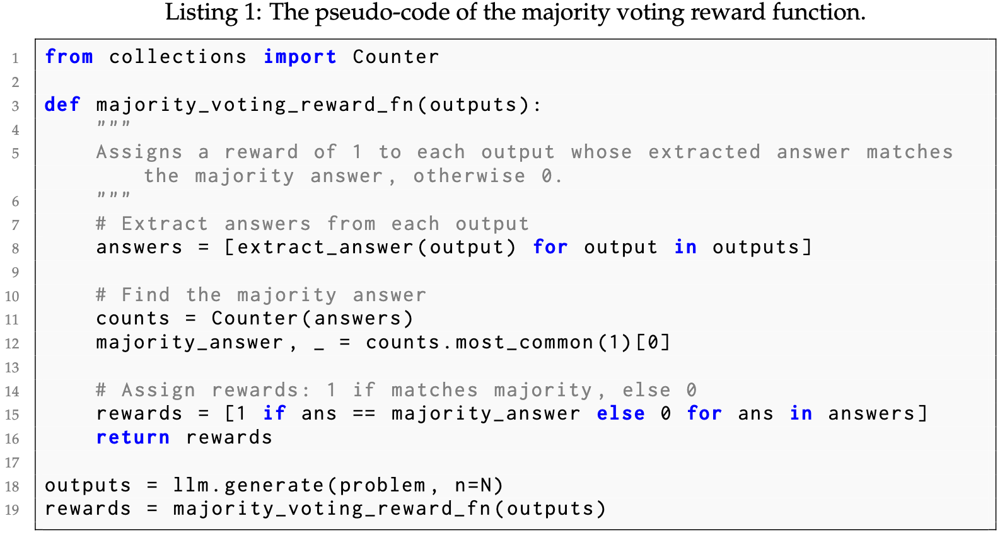

<div align="center">

# Rule-Based Reward Modeling for Large Reasoning Models Post-Training


</div>

<div align="center" style="font-family: Arial, sans-serif;">
  <p>
    <a href="#news" style="text-decoration: none; font-weight: bold;">🎉 News</a> •
    <a href="#introduction" style="text-decoration: none; font-weight: bold;">📖 Introduction</a> •
    <a href="#main-results" style="text-decoration: none; font-weight: bold;">📊 Main Results</a>
  </p>
  <p>
    <a href="#getting-started" style="text-decoration: none; font-weight: bold;">✨ Getting Started</a> •
    <a href="#contact" style="text-decoration: none; font-weight: bold;">📨 Contact</a> •
    <a href="#citation" style="text-decoration: none; font-weight: bold;">🎈 Citation</a> •
    <a href="#star-history" style="text-decoration: none; font-weight: bold;">🌟 Star History</a>
  </p>
</div>


# 📖Introduction

Recent developments in the field of LLMs and the emergence of reasoning capabilities from foundational
models has sparked a wave of specialized models for reasoning and math tasks employing novel and
sophisticated prompting, training and finetuning techniques, these models are often referred to as Large
Reasoning Models LRMs. Some of the most prominent models tailored for such tasks are Open AI’s
o-series models, Llama Nemotron, Deepseek R1, and Qwen-Math model series. At the center of these
models’ development are ideas such as Chain of Thought (CoT) and Tree of Thought (ToT) prompting as
well as RLHF post-training. This work investigates the potential of simple reward modeling using rulebased techniques to enhance finetuning without using labeled examples. Our work builds on a recent
method called ”Test Time Reinforcement Learning (TTRL)”, that performs finetuning on LLMs using RL
with unlabeled data. TTRL takes a finite set of samples from the model during inference and uses majority
voting to construct binary rewards that are fed to the RL pipeline for finetuning. Our work develops an
additional intermediate step that adds or subtracts additional reward signals based on a set of rules such
as prompt-to-response length ratio, compression ratio, and the presence of code and other patterns in
the response. Two of our methods show significant improvement in reward and reward accuracy over
two math tasks, AIME 2024 and AMC.

# Methodology
In this work we aim to utilize Test-Time Reinforcement Learning along with simple rule based reward models to enhance LLMs performance during inference. 
The figure below shows the main pipeline for Test Time Reinforcement Learning [8]. It mainly involves querying the model with query q and then sampling top M prediction sequences from the model and utilizing a simple majority voting function to get model answer y. The model answer is then used for reward calculation. A batch of M rewards are calculated and then fed to a policy optimization loop to finetune model parameters.
<p align="center">
   
</p>


<p align="center">
   
</p>


# 📊Main Results

Three experiments were carried out to verify the efficacy of the methods mentioned in the past section. One experiment tested a combination of the response-prompt length ratio and the format alignment. The second experiment tested a combination of response-prompt length ratio and code presence. The third experiment tested a combination of all the methods presented in the last section. The second and third experiments led to model collapse, therefore we only consider the results of the first experiment which are detailed in figure 2
<p align="center">
   
</p>


# ✨Getting Started

You can reproduce the results on `AIME 2024` with the following commands:

```bash
git clone https://github.com/PRIME-RL/TTRL.git
cd verl

pip install -r requirements.txt

bash examples/ttrl/aime.sh
```

We additionally conducted three independent runs using the preview version of our code. Two of the runs achieved a pass@1 of 43.3, while one run reached 46.7. Please refer to the [Weights & Biases logs](https://wandb.ai/truman-yx-zuo-nlp/TTRL/workspace).

*All experiments were conducted on 8 * NVIDIA A100 80GB GPUs.*

<details>
<summary>
  Pseudo-Code
</summary>

The implementation of TTRL can be achieved rapidly by simply modifying the reward function. Please refer to the following code snippet for details:

<p align="center">
   
</p>
</details>

# 📨Contact

- Kaiyan Zhang: zhang-ky22@mails.tsinghua.edu.cn

- Ning Ding: dingning@mail.tsinghua.edu.cn

# 🎈Citation
If you find TTRL helpful, please cite us.

```bibtex
@article{zuo2025ttrl,
  title={Ttrl: Test-time reinforcement learning},
  author={Zuo, Yuxin and Zhang, Kaiyan and Qu, Shang and Sheng, Li and Zhu, Xuekai and Qi, Biqing and Sun, Youbang and Cui, Ganqu and Ding, Ning and Zhou, Bowen},
  journal={arXiv preprint arXiv:2504.16084},
  year={2025}
}
```

# 🌟Star History

[](https://www.star-history.com/#PRIME-RL/TTRL&Date)
