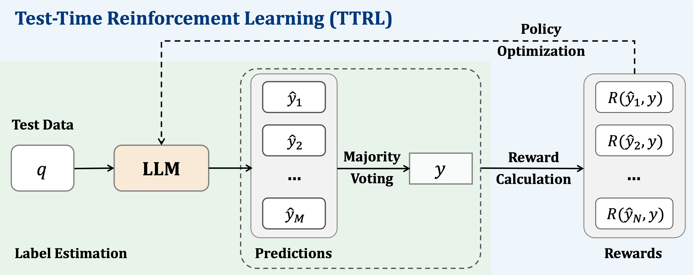
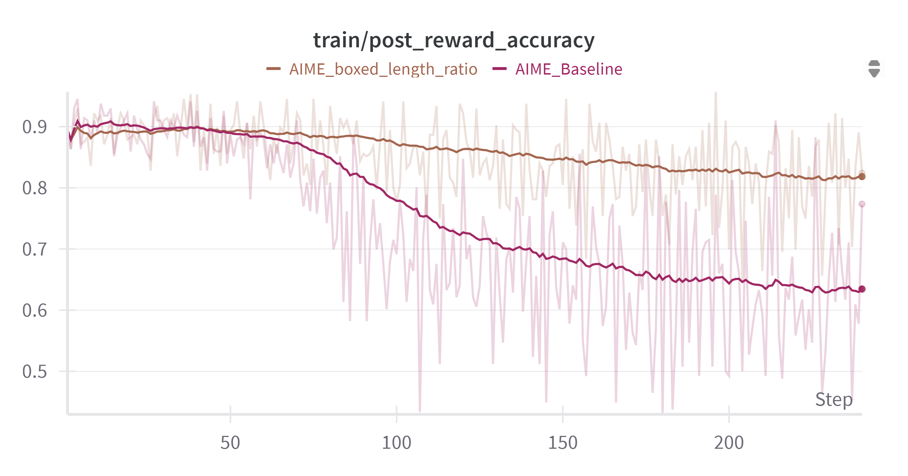
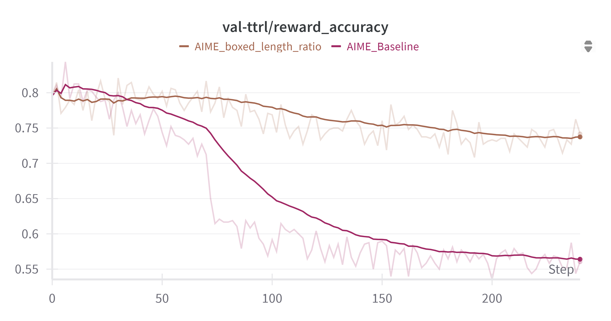
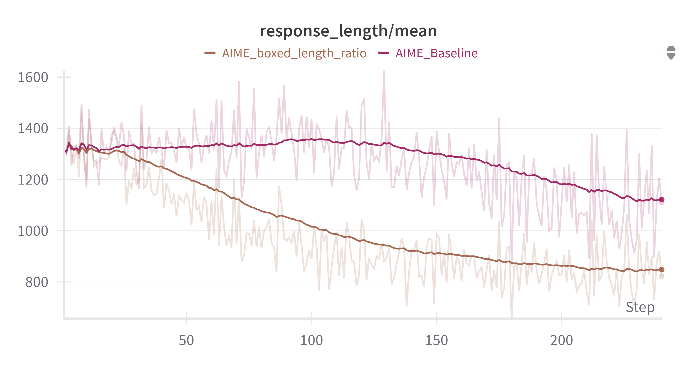
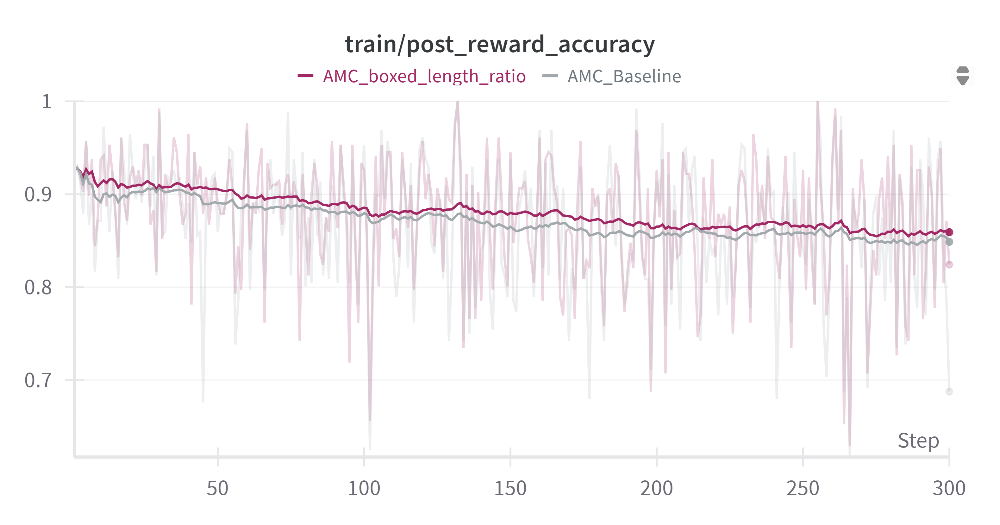
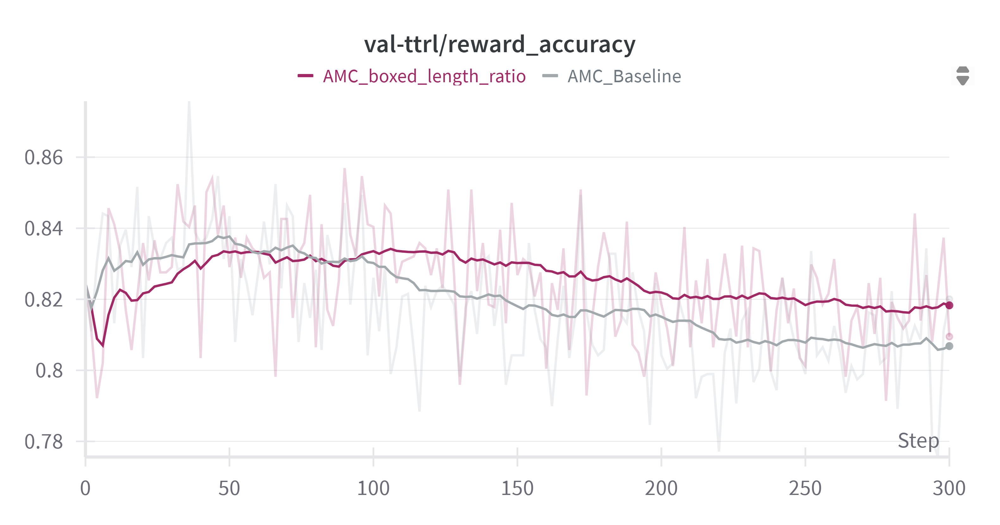
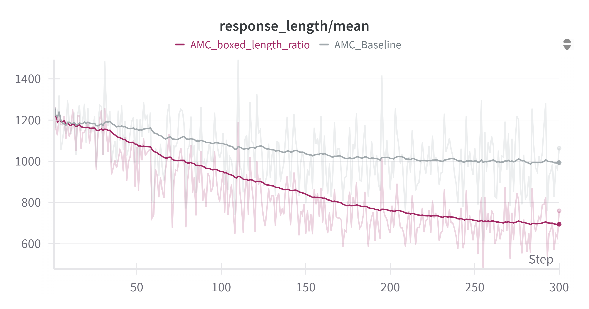

# Rule-Based Reward Modeling for Large Reasoning Models Post-Training

# 📖Introduction

Recent developments in the field of LLMs and the emergence of reasoning capabilities from foundational
models has sparked a wave of specialized models for reasoning and math tasks employing novel and
sophisticated prompting, training and finetuning techniques, these models are often referred to as Large
Reasoning Models LRMs. Some of the most prominent models tailored for such tasks are Open AI’s
o-series models, Llama Nemotron, Deepseek R1, and Qwen-Math model series. At the center of these
models’ development are ideas such as Chain of Thought (CoT) and Tree of Thought (ToT) prompting as
well as RLHF post-training. This work investigates the potential of simple reward modeling using rule-based techniques to enhance finetuning without using labeled examples. Our work builds on a recent
method called ”Test Time Reinforcement Learning (TTRL)”, that performs finetuning on LLMs using RL
with unlabeled data. TTRL takes a finite set of samples from the model during inference and uses majority
voting to construct binary rewards that are fed to the RL pipeline for finetuning. Our work develops an
additional intermediate step that adds or subtracts additional reward signals based on a set of rules such
as prompt-to-response length ratio, compression ratio, and the presence of code and other patterns in
the response. Two of our methods show significant improvement in reward and reward accuracy over
two math tasks, AIME 2024 and AMC.

# Methodology
In this work we aim to utilize Test-Time Reinforcement Learning along with simple rule based reward models to enhance LLMs performance during inference. 
The figure below shows the main pipeline for Test Time Reinforcement Learning. It mainly involves querying the model with query q and then sampling top M prediction sequences from the model and utilizing a simple majority voting function to get model answer y. The model answer is then used for reward calculation. A batch of M rewards are calculated and then fed to a policy optimization loop to finetune model parameters.

   

In this work we utilize this pipeline to test a combination of four different rule-based simple reward models
by adding a reward signal to the majority voting reward objective. These rules are inspired by the findings
of a recent publication: ”Logic-RL: Unleashing LLM Reasoning with Rule-Based Reinforcement Learning”. We run experiments using Qwen-2.5-Math 1.5 Billion model on two challenging math benchmarks, AIME
2024 and AMC.

The four reward models tested are:

* **Weighted response length to prompt length ratio**: This model adds a reward of $\min(\frac{5 - R/P}{5}, 0)$ to the majority voting reward, where $R$ is the response length and $P$ is the prompt length. This penalizes excessively long responses.
* **Weighted compression ratio**: Using Python's built-in `zlib` library, this model adds a reward of $\frac{3.5 - C}{7}$ to the majority voting reward, where $C$ is the compressed length of the answer text. This encourages concise responses.
* **Format**: The model checks if the final answer is correctly enclosed within a `\boxed{}` element. If the element is missing, a penalty of $1$ is subtracted from the majority voting reward.
* **Code**: This model checks for the presence of code in the response and applies a penalty of $0.5$.

# 📊Main Results

Three experiments were carried out to verify the efficacy of the methods mentioned in the past section. One experiment tested a combination of the response-prompt length ratio and the format alignment. The second experiment tested a combination of response-prompt length ratio and code presence. The third experiment tested a combination of all the methods presented in the last section. The second and third experiments led to model collapse, therefore we only consider the results of the first experiment which are detailed in these figures: 

  

    
  

  

    
  

  

    
  

  

    
  

  

    
  

  

    
  

*All experiments were conducted on 8 * NVIDIA A100 40GB GPUs.*

# 📨Contact

- Muhammad Omer: maomer@alumni.cmu.edu

